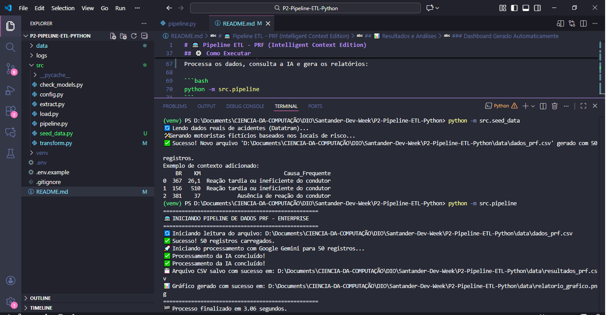
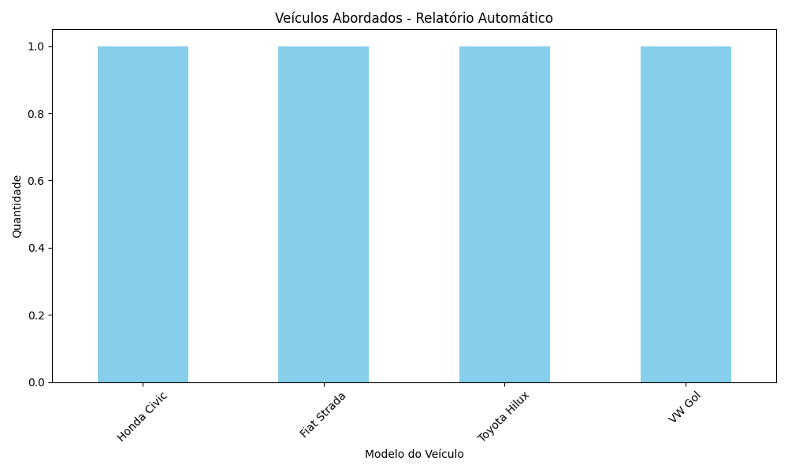

# 🚔 Pipeline ETL - PRF (Intelligent Context Edition)

Projeto de Engenharia de Dados avançado focado em segurança viária. Utiliza **Python Assíncrono**, **Enriquecimento de Dados (Data Enrichment)** com base em históricos reais de acidentes e **IA Generativa** para criar alertas contextuais.

  

## 🚀 Evolução do Projeto
Este projeto simula um sistema "Enterprise" da Polícia Rodoviária Federal. Diferente de scripts básicos que geram frases genéricas, este pipeline:
1.  **Analisa o local** onde o motorista está (BR, KM, Município).
2.  **Cruza com dados históricos** de acidentes reais (Datatran 2024/2025).
3.  **Gera um alerta específico** para o risco daquele trecho (ex: "Curva perigosa", "Animais na pista").

## 🏗️ Arquitetura e Tecnologias

* **Extração & Seed:** Script gerador de massa de dados (`seed_data.py`) que consome CSVs reais de acidentes de trânsito.
* **Enriquecimento (IA):** Google Gemini 2.0 Flash via API para análise de contexto geográfico.
* **Performance:** Processamento 100% Assíncrono (`asyncio`), processando 50 registros em ~3 segundos.
* **Resiliência:** *Retry Logic* (`tenacity`) para garantir robustez contra falhas de API.
* **Visualização:** Geração automática de gráficos analíticos (`matplotlib`).

## 📂 Estrutura do Projeto

```text
├── data/              # Dados brutos (Datatran) e processados
├── logs/              # Logs de execução
├── src/               # Código Fonte Modular
│   ├── config.py      # Configurações e Variáveis de Ambiente
│   ├── seed_data.py   # [NOVO] Gerador de dados fictícios baseado em locais reais
│   ├── extract.py     # Leitura e validação
│   ├── transform.py   # Lógica de IA Contextual (Gemini)
│   ├── load.py        # Carga e Dashboards
│   └── pipeline.py    # Orquestrador
├── .env.example       # Template de credenciais
└── README.md          # Documentação
```

## ⚙️ Como Executar

### 1. Preparação
Clone o repositório e configure o ambiente virtual:

```bash
git clone [https://github.com/danilogep/ETL-PRF-IA-Generativa.git](https://github.com/danilogep/ETL-PRF-IA-Generativa.git)
cd ETL-PRF-IA-Generativa
python -m venv venv

# Windows:
.\venv\Scripts\activate

# Linux/Mac:
source venv/bin/activate
```

### 2. Instalação e Configuração
Instale as dependências e configure sua chave de API do Google Gemini no arquivo `.env`:

```bash
pip install pandas google-generativeai python-dotenv tenacity matplotlib
```

### 3. Geração de Massa de Dados (Seed)
Este passo lê os arquivos históricos de acidentes e cria motoristas fictícios passando por locais de risco real:

```bash
python -m src.seed_data
```

### 4. Execução do Pipeline ETL
Processa os dados, consulta a IA e gera os relatórios:

```bash
python -m src.pipeline
```

## 📊 Resultados e Análises

O sistema gera logs detalhados e arquivos visuais na pasta `data/`.

### ⏱️ Performance de Execução
Log real de execução demonstrando o processamento assíncrono de 50 registros enriquecidos em **apenas 3 segundos**:



### Exemplo de Enriquecimento de Dados (Antes vs. Depois)

| Motorista | Local | Causa do Risco | **Mensagem Gerada pela IA** |
| :--- | :--- | :--- | :--- |
| Lucas G. | BR-10 (KM 502) | Animais na Pista | *"Atenção! Risco de animais na pista. Redobre a atenção e reduza a velocidade!"* |
| Pedro S. | BR-060 (KM 404) | Reação tardia | *"Atenção! Reaja rápido, evite acidentes. Prudência!"* |
| Julia O. | BR-116 (KM 536) | Retorno proibido | *"Atenção! Retorno proibido nesse trecho causa acidentes frequentes. Evite manobras irregulares!"* |

### Dashboard Gerado Automaticamente
O pipeline gera um gráfico de distribuição dos veículos abordados para análise estatística:



---
**Desenvolvido por Danilo Evangelista**
